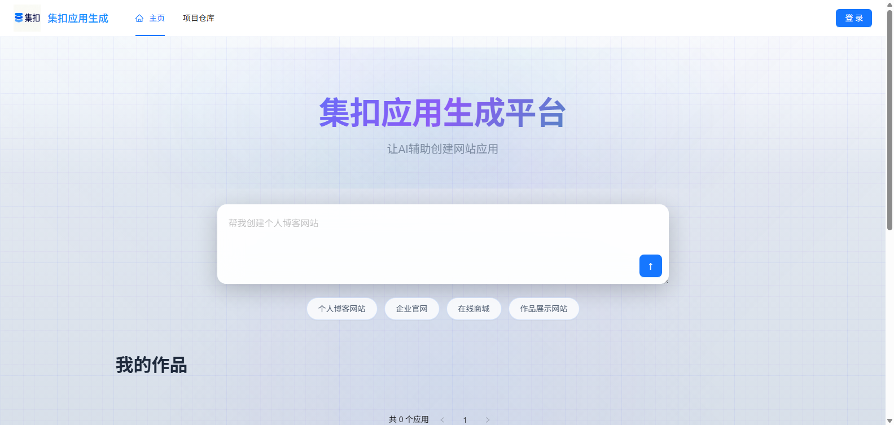
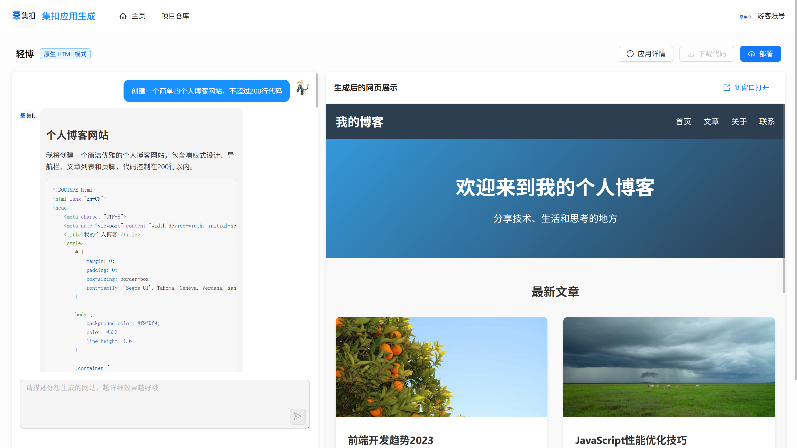
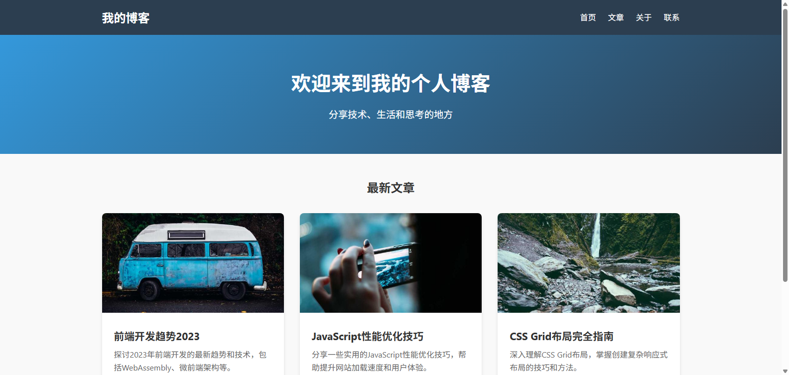

# 集扣AI低代码应用生成平台

## 项目介绍

集扣AI低代码应用生成平台是一个基于Spring Boot的智能代码生成平台，集成了先进的AI模型（通过LangChain4j），能够根据用户需求快速生成高质量的HTML单页面网站和完整的Vue3项目。平台还包含用户管理、应用管理、对话历史记录等完整功能体系，为开发者提供高效便捷的代码生成体验。





## 核心功能

- **AI代码生成**：支持HTML单页面和Vue3项目的智能生成
- **用户管理**：完整的用户注册、登录、权限控制体系
- **应用管理**：创建、部署和管理AI代码生成应用
- **对话历史**：记录并管理用户与AI的交互历史
- **VIP系统**：支持VIP用户特权管理
- **邀请码系统**：用户邀请机制
- **网页截图**：自动生成网站截图功能
- **项目下载**：生成的代码支持打包下载

## 技术栈

### 后端技术
- Spring Boot 3.5.4
- Java 21
- MyBatis-Flex（ORM框架）
- MySQL 数据库
- Redis（缓存、会话存储）
- RabbitMQ（消息队列）
- LangChain4j（AI模型集成）
- Knife4j（API文档）
- Selenium（网页截图）
- 腾讯云COS（文件存储）

### AI能力
- OpenAI API 集成
- 代码生成提示模板系统
- 流式响应处理

## 快速开始

### 环境要求
- JDK 21+
- Maven 3.8+
- MySQL 8.0+
- Redis 6.0+
- RabbitMQ 3.8+
- Node.js 18+（Vue项目生成时使用）

### 数据库初始化

1. 执行`sql/create_table.sql`文件初始化数据库结构：

```bash
mysql -u root -p < sql/create_table.sql
```

2. 默认管理员账号：
   - 账号：shikou
   - 密码：test1234（已加密存储）

3. 游客账号：
   - 账号：guest
   - 密码：guest1234

### 配置修改

1. 配置数据库连接：修改`src/main/resources/application.yml`中的数据库连接信息

2. 配置Redis和RabbitMQ：根据实际部署环境修改对应的连接信息

3. 配置OpenAI API密钥：需要在环境变量或配置文件中设置API密钥

### 项目启动

使用Maven启动项目：

```bash
mvn spring-boot:run
```

或者打包后运行：

```bash
mvn clean package
java -jar target/ai-code-0.0.1-SNAPSHOT.jar
```

## 项目结构

```
src/main/java/com/shikou/aicode/
├── Application.java          # 项目入口
├── ai/                       # AI相关功能模块
│   ├── model/                # AI模型和结果定义
│   ├── tool/                 # AI工具定义
│   └── guradrail/            # AI安全防护
├── controller/               # 控制器层
├── service/                  # 服务层
├── mapper/                   # 数据访问层
├── model/                    # 数据模型
│   ├── dto/                  # 数据传输对象
│   ├── entity/               # 实体类
│   ├── enums/                # 枚举类
│   └── vo/                   # 视图对象
├── config/                   # 配置类
├── common/                   # 公共模块
├── exception/                # 异常处理
└── utils/                    # 工具类
```

## API文档

项目启动后，可以访问以下地址查看API文档：

```
http://localhost:8123/api/doc.html
```

## 功能模块详解

### 1. AI代码生成

平台支持三种主要的代码生成模式：

- **HTML单页面**：根据用户需求生成完整的HTML单页面，包含内嵌的CSS和JavaScript
- **HTML、CSS、JS多文件生成**：根据用户需求生成完整的HTML、CSS、JavaScript文件
- **Vue3项目生成**：生成完整的Vue3 + Vite项目结构，包含路由、组件等

代码生成流程：
1. 用户提交代码生成请求
2. 系统根据请求类型选择合适的AI模型和提示模板
3. AI生成代码并流式返回给用户
4. 生成完成后，可选择下载生成的代码

### 2. 用户管理

系统包含完整的用户管理功能：

- 用户注册、登录、登出
- 用户信息修改
- 角色权限控制（普通用户、管理员、游客）
- 用户硬币系统（用于兑换VIP和邀请码）
- VIP系统（提高每日对话上限，普通用户\游客：20次 VIP：50次）

### 3. 应用管理

用户

- 创建自定义应用
- 修改应用名称
- 设置应用初始化提示
- 部署应用

管理员

- 管理应用优先级
- 设置精选应用

### 4. 对话历史

系统记录用户与AI的所有交互历史：

- 按应用查看对话历史
- 支持对话历史的分页查询
- 记录用户消息和AI响应

### 5. 网页截图

系统通过Selenium实现网页截图功能：

- 异步截图处理（通过RabbitMQ消息队列）
- 支持将截图存储到本地或云存储

## 配置详解

### 主要配置项

1. **服务器配置**
   - 端口：8123
   - 上下文路径：/api

2. **数据库配置**
   - URL：jdbc:mysql://localhost:3306/ai_code
   - 用户名：root
   - 密码：123456

3. **Redis配置**
   - 主机：localhost
   - 端口：6379
   - 数据库：0

4. **RabbitMQ配置**
   - 主机：localhost
   - 端口：5672
   - 用户名：admin
   - 密码：admin
   - 虚拟主机：/ai-code

## 部署说明

### 本地开发环境

1. 确保所有依赖服务（MySQL、Redis、RabbitMQ）正常运行
2. 修改配置文件中的连接信息
3. 启动项目

### 生产环境

1. 推荐使用Docker容器化部署
2. 配置环境变量或外部配置文件
3. 设置安全组和防火墙规则
4. 配置HTTPS（推荐）

```yml
# 线上配置文件
spring:
  # mysql
  datasource:
    driver-class-name: com.mysql.cj.jdbc.Driver
    url: jdbc:mysql://<你的MySql地址>:3306/ai_code
    username: <你的MySql用户名>
    password: <你的MySql密码>
  # redis
  data:
    redis:
      host: <你的Redis地址>
      port: 6379
      database: 0
      password: <你的Redis密码>
      ttl: 3600
  # rabbitMQ
  rabbitmq:
    host: <你的RabbitMQ地址>
    port: 5672
    username: <你的RabbitMQ用户名>
    password: <你的RabbitMQ密码>
    virtual-host: /ai-code
# AI
langchain4j:
  open-ai:
    chat-model:
      base-url: <LLM API地址>
      api-key: <你的LLM API密钥>
      model-name: <普通模型名称>
      max-tokens: 8192
      log-requests: true
      log-responses: true
    streaming-chat-model:
      base-url: <LLM API地址>
      api-key: <你的LLM API密钥>
      model-name: <流式模型名称>
      max-tokens: 8192
      log-requests: true
      log-responses: true
      temperature: 0.1
    resoning-stream-chat-model:
      base-url: <LLM API地址>
      api-key: <你的LLM API密钥>
      model-name: <推理模型名称>
      max-tokens: 8192
      log-requests: true
      log-responses: true
    routing-chat-model:
      base-url: <LLM API地址>
      api-key: <你的LLM API密钥>
      model-name: <路由模型名称>
      max-tokens: 8192
      log-requests: true
      log-responses: true
# 添加 COS 对象存储配置
cos:
  client:
    host: <COS对象存储地址>
    secretId: <COS对象存储SecretId>
    secretKey: <COS对象存储SecretKey>
    region: <COS对象存储区域>
    bucket: <COS对象存储Bucket>
# 生产环境关闭日志
mybatis-flex:
  configuration:
    log-impl: ''
# 接口文档配置
knife4j:
  basic:
    enable: true
    username: <接口文档用户名>
    password: <接口文档密码>
# 部署路径
code:
  deploy-host: http://<你的服务器地址>/dist

```

## 开发指南

### 代码规范

- 遵循Java开发规范
- 使用Lombok简化代码
- 服务层接口与实现分离
- 统一异常处理机制

### 添加新功能

1. 创建实体类和数据传输对象
2. 实现Mapper接口和XML映射文件
3. 创建Service接口和实现类
4. 添加Controller接口
5. 配置相关依赖和Bean

## 注意事项

1. OpenAI API密钥需要妥善保管，避免泄露
2. 生成的临时文件会定期清理
3. 游客账号有访问限制
4. 系统包含请求频率限制

## License

[MIT](https://opensource.org/licenses/MIT)

## 更新日志

### 0.0.1-SNAPSHOT
- 初始版本
- 支持HTML单页面生成
- 支持Vue3项目生成
- 完整的用户管理系统
- 应用管理和对话历史功能